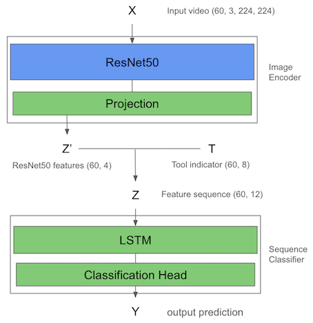
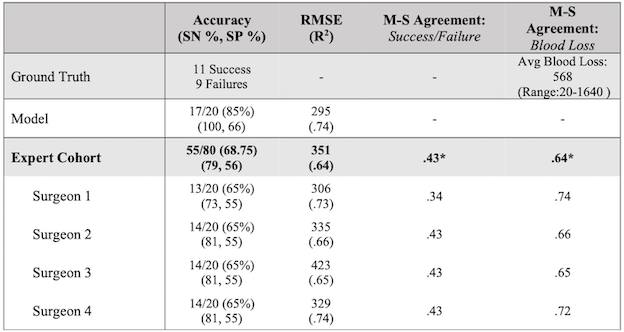

# MAT497Y1: Research Project in Mathematics - "Assessing Surgical Performance via Intraoperative Video and Deep Learning"

## About this project
This GitHub repository holds the code for a research project conducted by Jonah Mackey, titled "Assessing Surgical Performance via Intraoperative Video and Deep Learning". This project was completed through a full-year undergraduate research course (MAT497Y1: Research Project in Mathematics) under the supervision of Prof. Vardan Papyan at the University of Toronto during the fall 2021-winter 2022 academic school year. In this course, students must conduct an independent research project under the direction of a faculty member of the Department of Mathematics of U of T. Jonah received an A+ (100) grade for his work on this project.

## Project background
Previously, a team of neurosurgeons, machine learning researchers, and medical science researchers led by Daniel Donoho set out with the goal to develop a deep learning model to assess surgical performance from intraoperative video. They implemented models and trained them on the publicly available video dataset Simulated Outcomes following Carotid Artery Laceration (SOCAL) to predict estimated blood loss and task success. 

### Previous model architecture
The architecture of their model constisted of two parts: an image encoder that encodes the video frames and a sequence classifier that makes predictions from the sequence of encoded frames. The image encoder consisted of a ResNet50 with frozen pretrained ImageNet weights and was followed by a linear projection that was pretrained on video frames from the dataset. After pretraining, the image encoder outputted 4 dimensional features for each video frame, and these features were concatenated with an 8 dimensional tool-indicator vector that indicates which tools were seen in the frame. These sequences of 12 dimensional features were used to train the sequence classifier which consisted of an LSTM followed by a classification head.

Their model reached 85% accuracy on task success and 295 RMSE on estimated blood loss, which surpassed the results from an expert cohort of 4 surgeons. Thier full results are shown below:

## Our contributions 
The overarching goal of the MAT497 research project was to expose the student to real world machine learning applications and research setting. 

 research project was to improve upon their model by developing a new model and training it on remote GPU clusters. This project was intended to 

- talk about what the repo is about
- project outline and background
- my contribution
- next steps... surgeons are collection larger dataset. working on interperetability methods and methods that involve larger videos.
